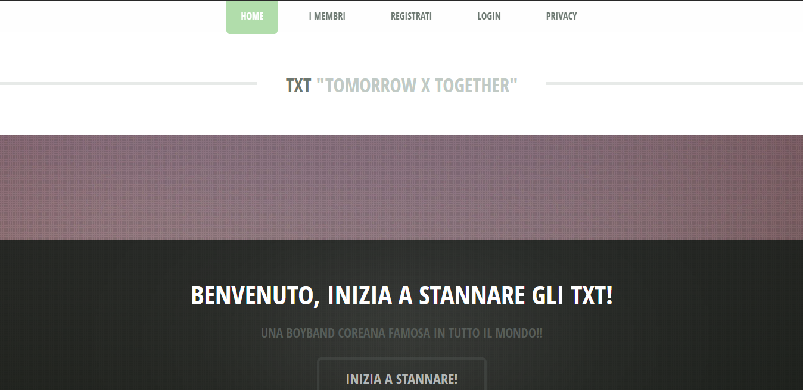
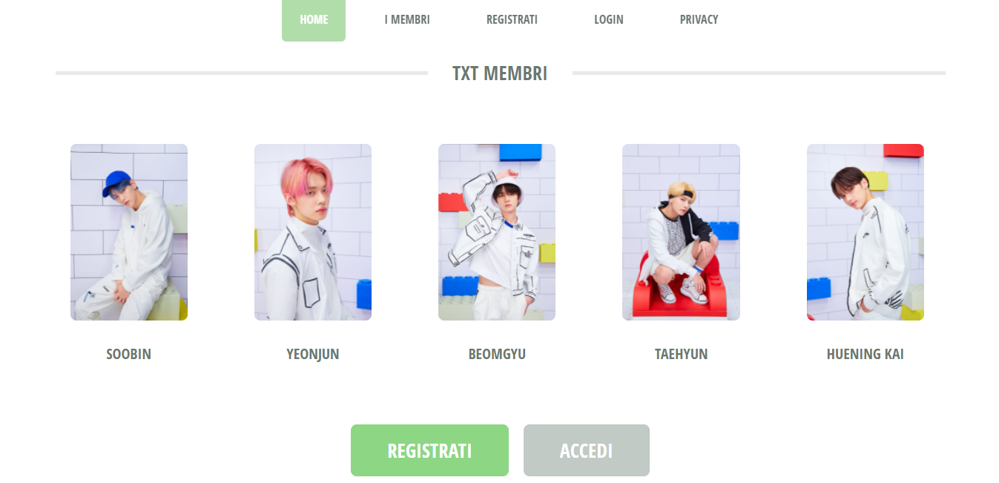

# SecondaWeb
## Progetto scolastico Marzo 2021

- Progetto creato in mvc, Asp Net, dotnet 5
- Al suo interno vi è la Registrazione e il Login che permetterà poi di accedere alla pagina di Privacy.
- Per il design è stato utilizzato il seguente tema in quanto quello che mi era stato assegnato non mi permetteva la gestione multipage: https://html5up.net/txt
- E' disponibile anche su [Azure](https://mgiorgia.azurewebsites.net/)
--------------------------------
